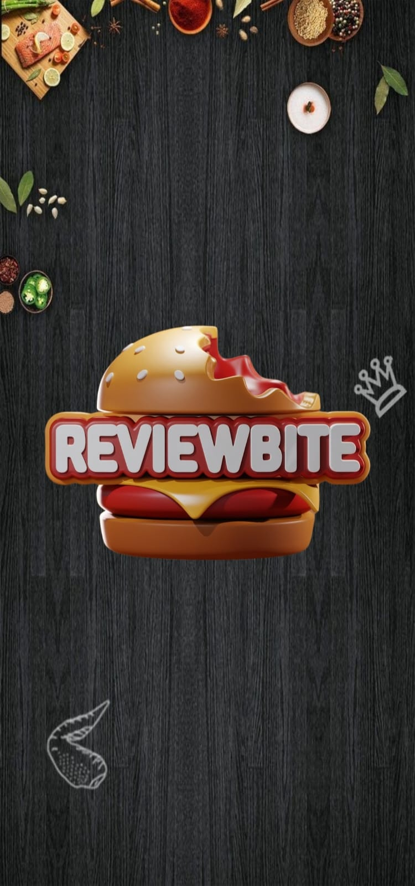
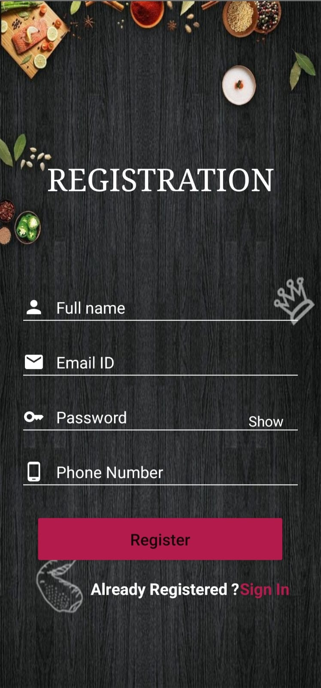
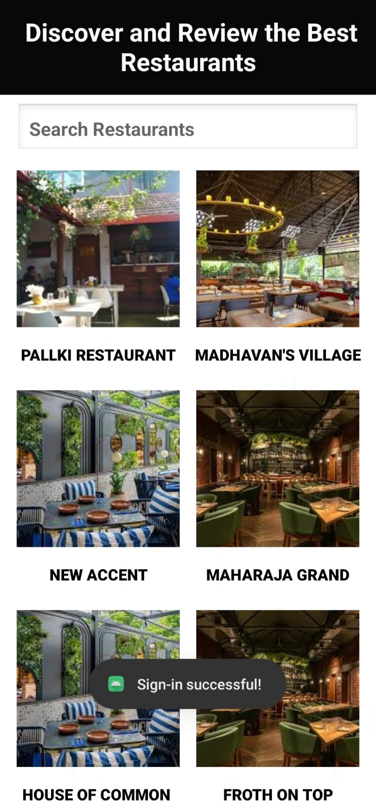
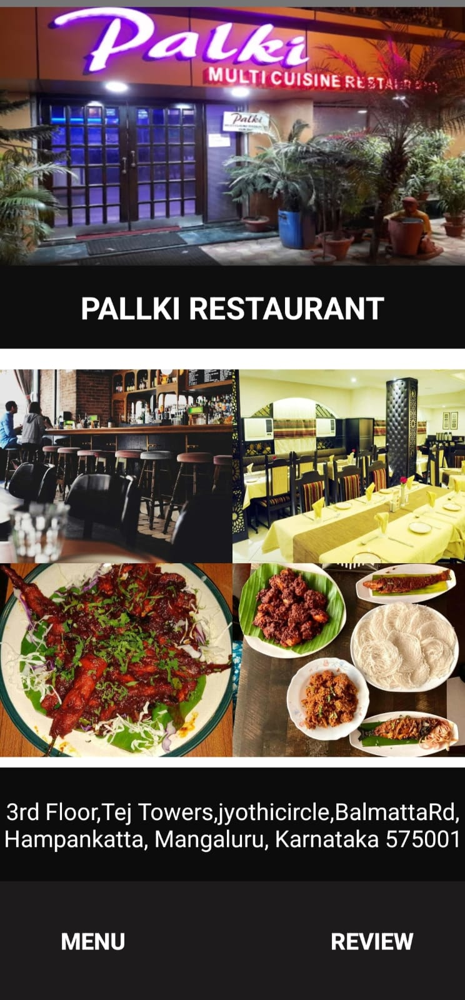
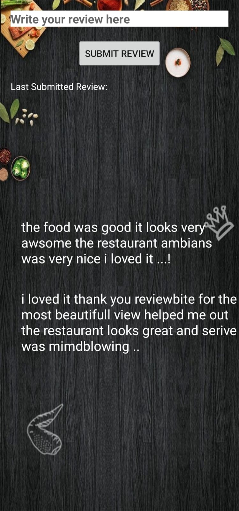
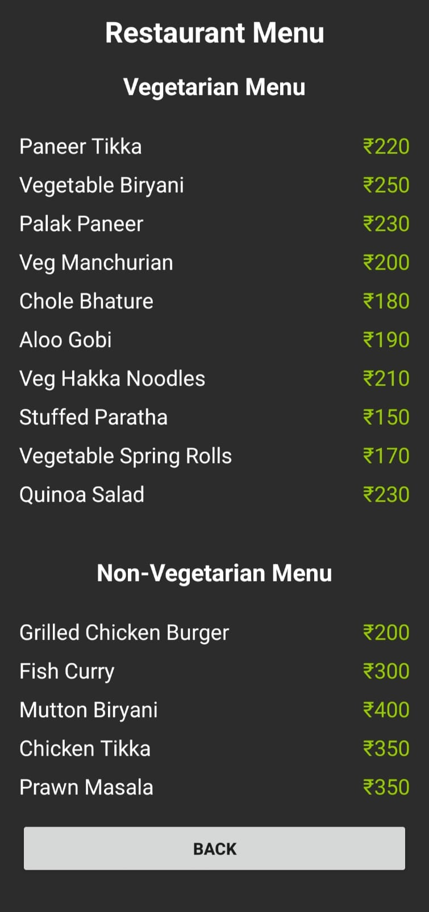

# ReviewBite

**ReviewBite** is a comprehensive food review application that allows users to share their dining experiences, discover new restaurants, and interact with a community of food enthusiasts. The app includes user and admin modules, each designed with specific functionalities to enhance the dining and review experience.

## Features

### Customer Module
- **User Authentication:** Register and log in via email or social media.
- **Restaurant Listings:** Detailed profiles with location, menu, operating hours, and photos.
- **Review and Rating System:** Post reviews, rate restaurants, upload images, and interact with other users' reviews.
- **Search and Discover:** Filter and sort restaurants by cuisine, location, dietary preferences, and more.
- **Photo Uploading:** Upload food photos directly from the gallery or capture in-app.

### Admin Module
- **Restaurant Management:** Add and update restaurant information.
- **User Interaction:** Monitor user activity and respond to reviews.
- **Content Control:** Manage restaurant listings, events, and offers, but reviews remain unmodifiable for transparency.

## Screenshots

Here are some screenshots that showcase the **ReviewBite** application:

### 1. Splash Screen


### 2. Registration 


### 3. Home Screen


### 4. Restaurant Details


### 5. Review Submission


### 4. Restaurant Menu



## Technologies Used
- **Programming Language:** Kotlin (Android)
- **IDE:** Android Studio
- **Version Control:** Git

## Installation

1. **Clone the repository:**
   ```bash
   git clone https://github.com/your-username/ReviewBite.git
   ```
2. **Open in Android Studio:** Import the project and sync Gradle dependencies.
3. **Set up Firebase:** Connect the app to Firebase for storage and authentication.
4. **Run the App:** Test on an Android emulator or device.

## Testing

The app has been tested across multiple modules:
- **Unit Testing:** Core functionalities like authentication, review submissions, and search.
- **UI Testing:** Ensures seamless interaction with the user interface.
- **Integration Testing:** Validates data flow between frontend and backend.
- **Performance Testing:** Simulates user load to check responsiveness under high traffic.

## Future Enhancements
- **Advanced Search:** Search by specific cuisines and restaurant types.
- **Enhanced Media Uploads:** Support for videos along with photos in reviews.
- **Geolocation & Maps Integration:** Location-based restaurant suggestions.
- **Table Reservation:** Integration with online booking systems.
